# Cineoma

### 목차

1. [프로젝트 소개](#프로젝트-소개)
2. [Project Period](#project-period)
3. [Contributors](#contributors)
4. [상세 기능](#상세-기능)

# 프로젝트 소개

### Cineoma

WebRTC를 활용한 프로젝트로, 화상미팅을 활용해 마피아게임 서비스를 만들었습니다. 

화상미팅을 활용하는 만큼, Teachable Machine을 활용한 모션인식 기능을 넣어 다른 마피아게임과 차별성을 두었습니다.

특수직업인 ‘교주’를 뽑은 유저는 모션인식을 이용한 미션을 수행해 신도카운트를 모아 승리할 수 있습니다.

# Project Period

SSAFY 7기 2학기 공통 프로젝트

2022.07.04 ~ 2022.08.19

# Contributors

| 팀원   | 역할          | 담당                                            |
| ------ | ------------- | ----------------------------------------------- |
| 김민철 | 팀장, Backend | 배포, API 설계 및 개발, UCC 제작                |
| 권민용 | Backend       | 인게임 개발, API 설계 및 개발                   |
| 남한솔 | Backend       | API 설계 및 개발                                |
| 박정현 | Frontend      | 회원관리 개발, 프로필페이지 개발, 인게임 로직   |
| 박제학 | Frontend      | 로비페이지 개발, 모션인식 적용, 인게임 로직     |
| 이근희 | Frontend      | openvidu, 대기방페이지 개발, 인게임 타이머 개발 |

# 상세 기능

- ### 로그인

- ### 회원가입

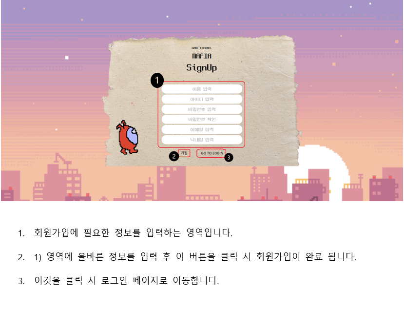

- ### 로비

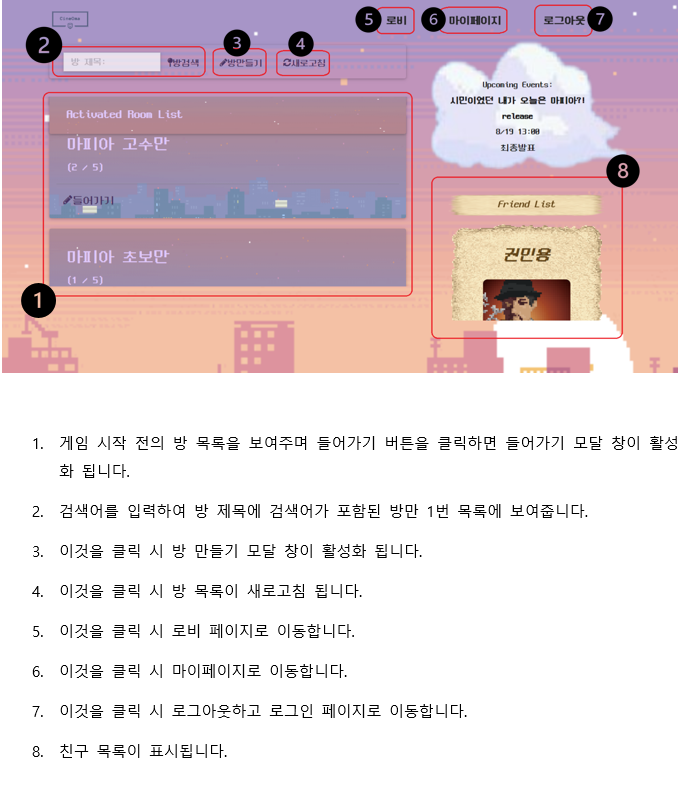

- ### 방 입장

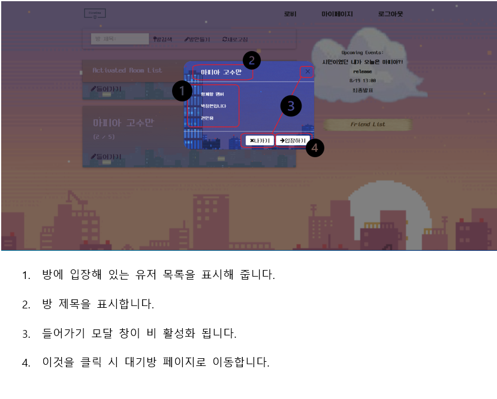

- ### 대기방

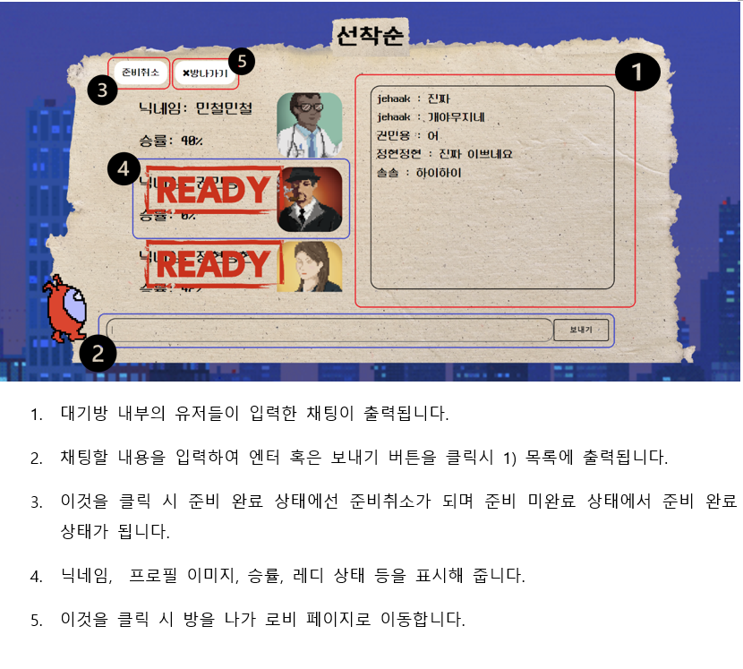

- ### 인게임

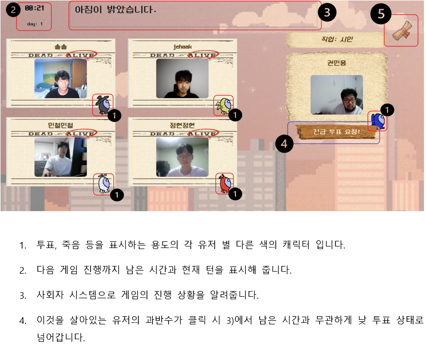

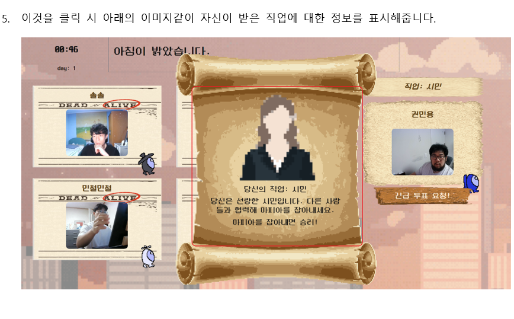

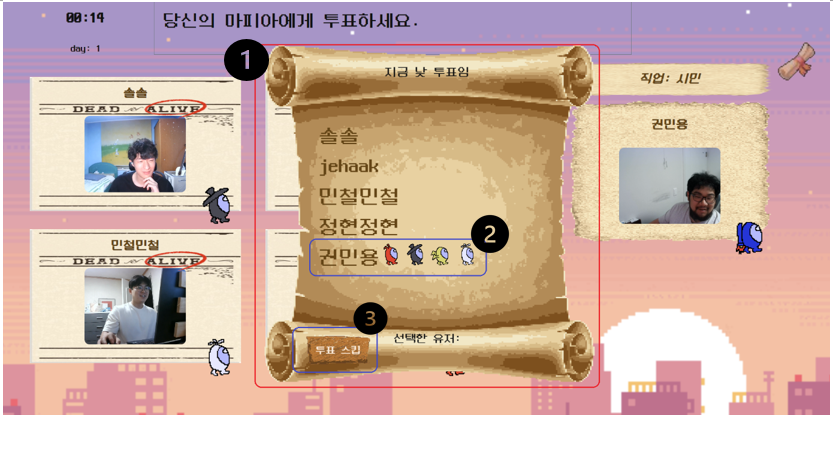

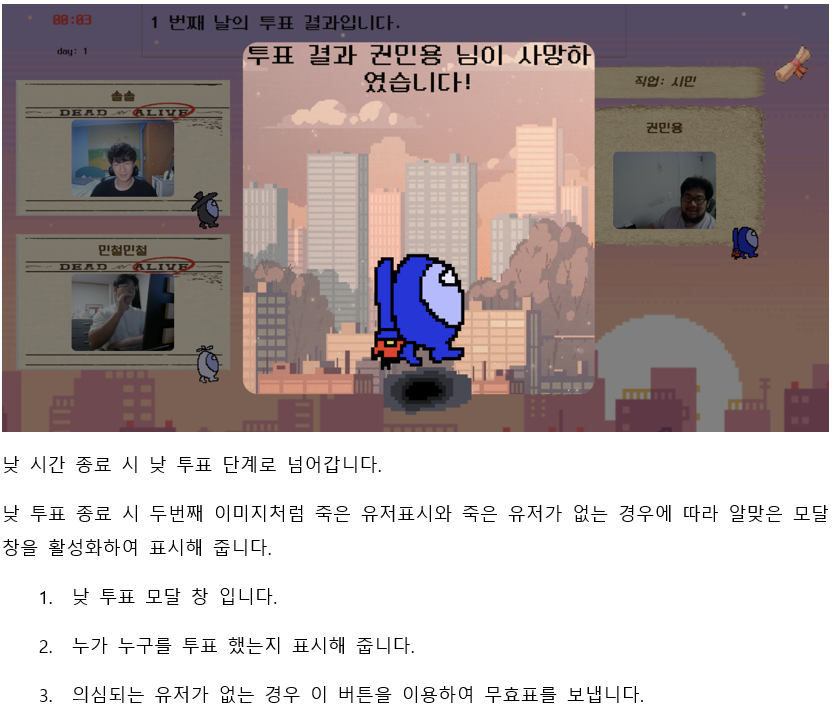

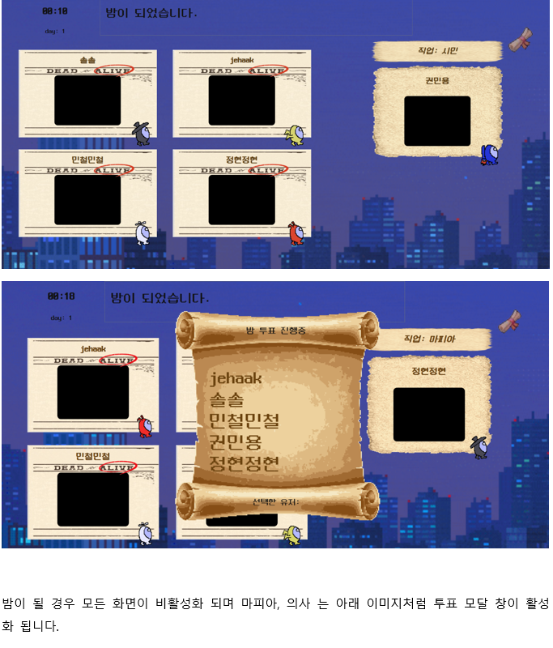

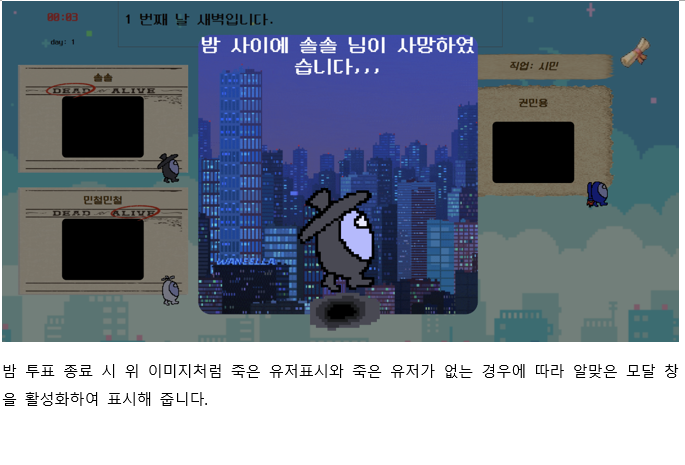

- ### 특수 직업

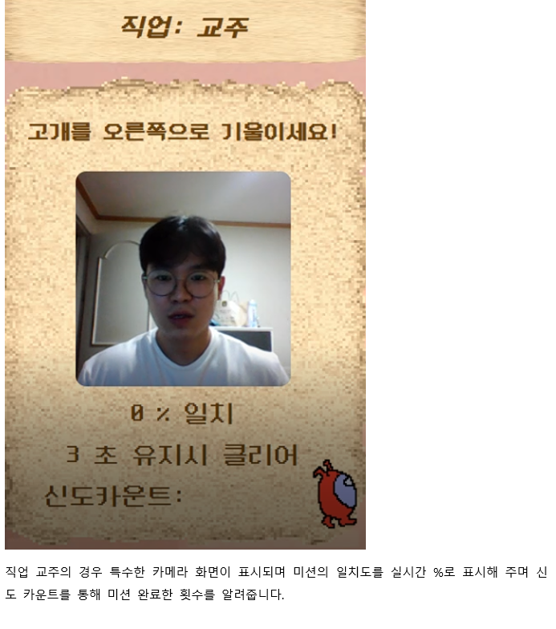

- ### 결과 페이지

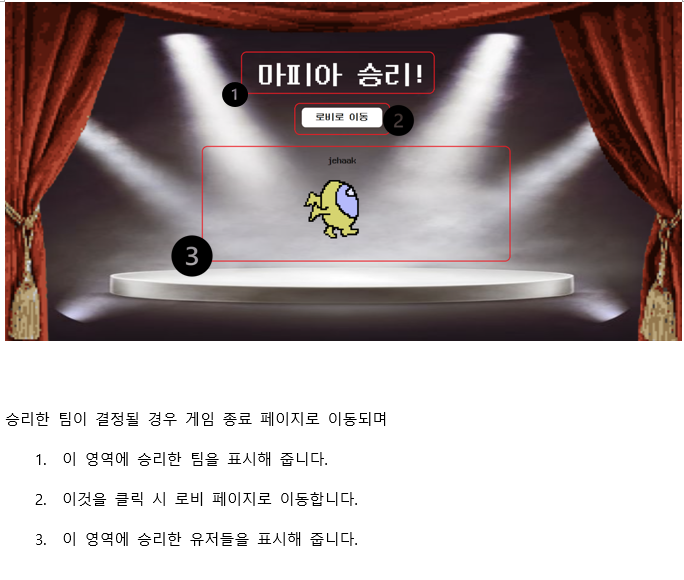
